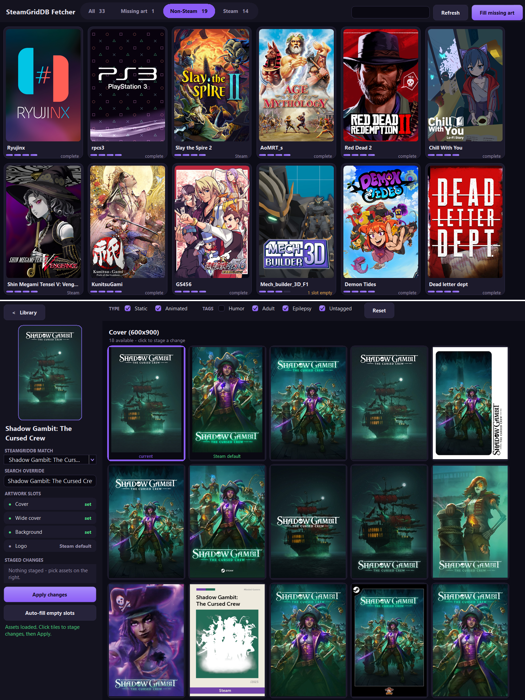

# SteamGridDB Fetcher

A small Windows app for filling in missing Steam library artwork, entirely vibecoded, so keep that in mind. It pulls covers, wide covers (headers), backgrounds and logos from [SteamGridDB](https://www.steamgriddb.com) and applies them to your Steam library - mainly for non-Steam shortcuts, which have no artwork at all by default, but it works on regular Steam games too.

## What it does

- Shows your whole library (non-Steam shortcuts + installed Steam games) as a poster grid, with a meter on each card showing which of the four art slots are filled
- **Fill missing art** grabs the official Steam artwork for everything that has empty slots - it only ever fills gaps, it never replaces art you already have
- Click a game to pick artwork by hand: browse everything SteamGridDB has for it, including animated assets (previews play right in the app), stage your picks per slot, then apply them all at once
- Filters for asset type and tags (static/animated, humor, adult, epilepsy), same as the SGDB site
- Every applied change is backed up first, and there's an undo button
- It only writes image files into Steam's `userdata/.../config/grid` folder - it never touches game files, so there's nothing for anti-cheat to care about

## Setup

1. Grab `SteamGridDBFetcher.exe` from the repo (or build it yourself, see below) and put it in any folder - it writes its `config.json` and `backups/` next to itself
2. Get a free API key from SteamGridDB: [steamgriddb.com](https://www.steamgriddb.com) → Profile → Preferences → API
3. Run the app - it asks for the key on first start

## Building

No dependencies to install - it compiles with the C# compiler that ships with Windows (.NET Framework 4.8). Just run:

```
build.bat
```
